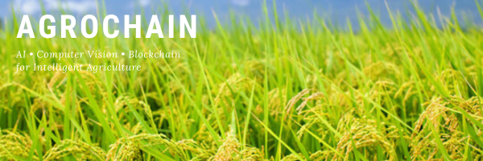
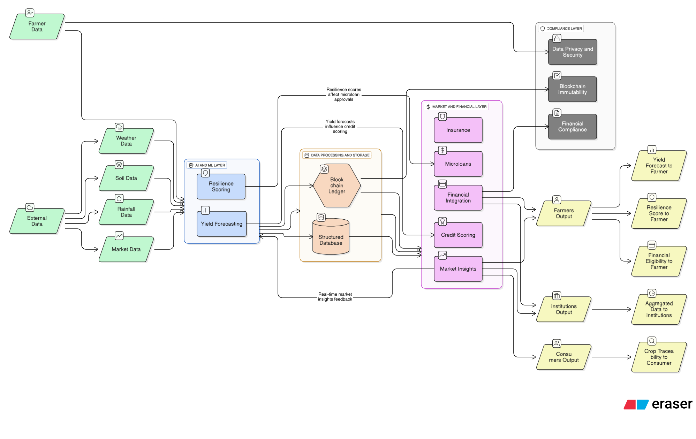
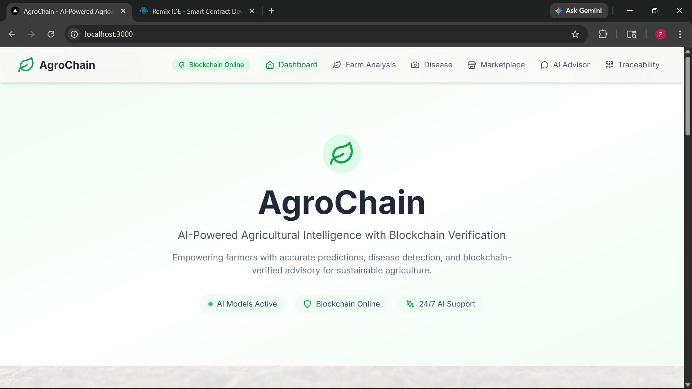
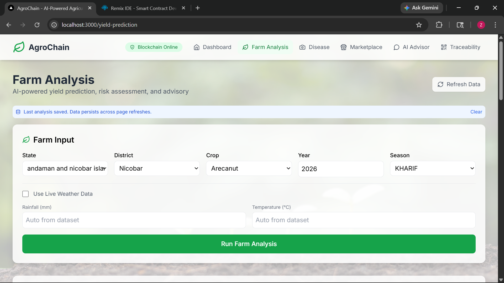
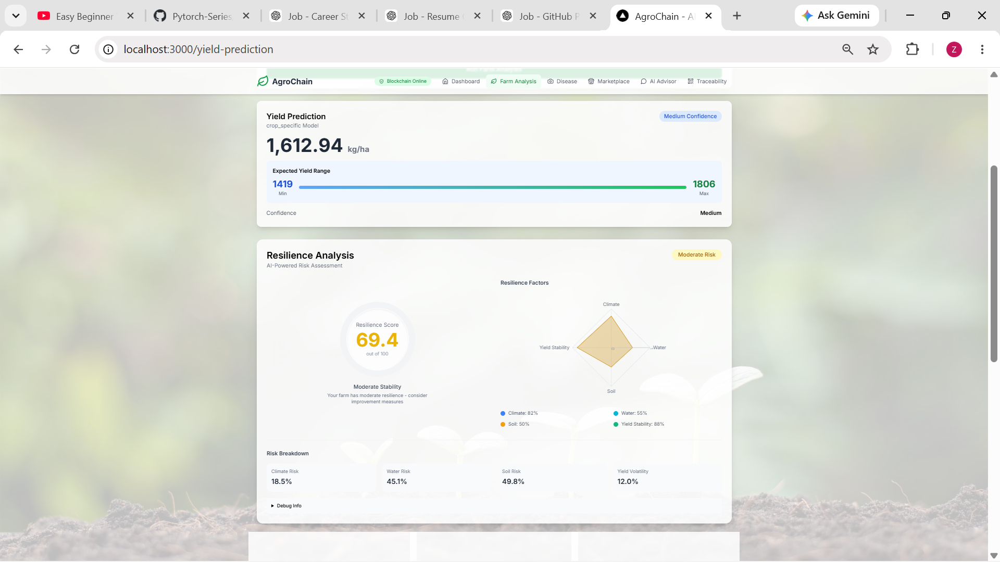
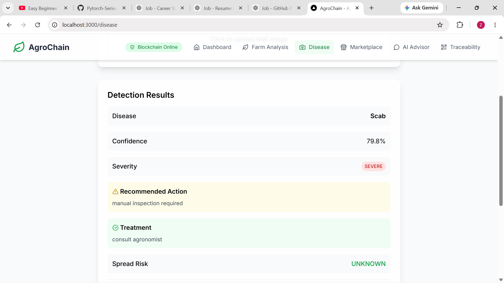
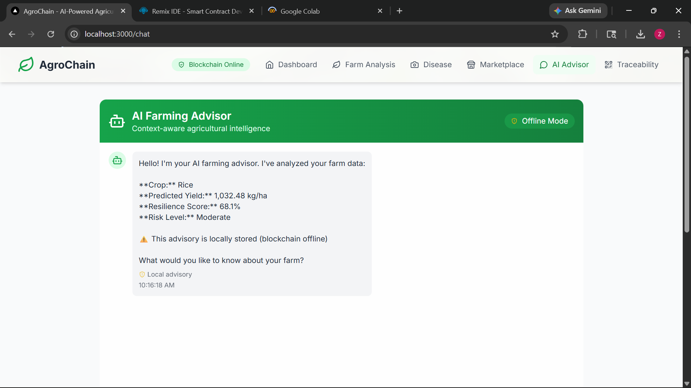
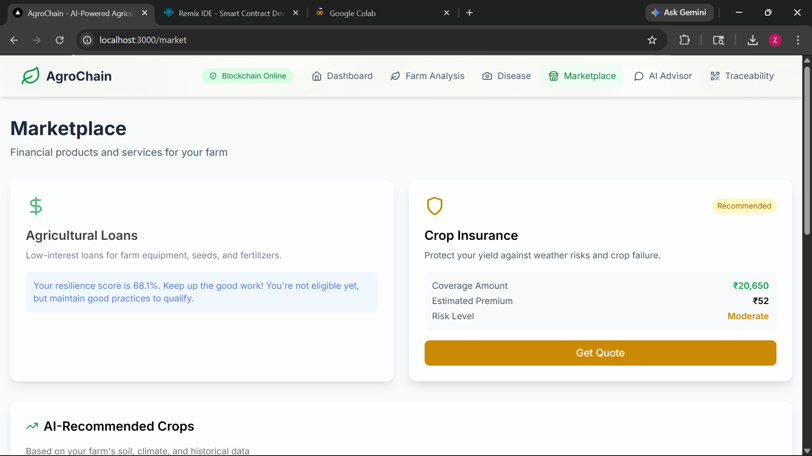

<p align="center">
  
</p>

# AgroChain

<p align="center">


</p>

> A Multi-Modal Agricultural Intelligence Platform integrating Machine Learning, Computer Vision, AI Advisory Systems, and Blockchain-Based Verification for Data-Driven Agricultural Decision Making.

---

## Overview

AgroChain is an end-to-end agricultural intelligence platform designed to support data-driven farming decisions through artificial intelligence, computer vision, and blockchain technology.

The platform combines predictive analytics, disease detection, soil analysis, AI-powered advisory systems, and blockchain-based verification into a unified agricultural decision-support framework.

Developed as a final-year engineering research project, AgroChain demonstrates the integration of machine learning, deep learning, retrieval-augmented generation (RAG), and decentralized verification systems within the agriculture domain.

---

## Problem Statement

Modern agriculture faces several challenges:

- Incorrect crop selection
- Yield uncertainty
- Delayed disease identification
- Climate-related agricultural risks
- Limited access to expert advisory services
- Fragmented agricultural information
- Lack of trust and transparency in agricultural records

AgroChain addresses these challenges through an integrated intelligence platform capable of generating explainable and verifiable agricultural recommendations.

---

## Key Features

### Machine Learning

- Crop Recommendation System
- Yield Prediction Engine
- Farm Analysis Module
- Climate Risk Assessment
- Agricultural Resilience Scoring

### Computer Vision

- Crop Disease Detection
- Soil Type Classification

### AI Advisory System

- RAG-Based Agricultural Assistant
- Context-Aware Recommendations
- Agricultural Knowledge Retrieval

### Blockchain

- Advisory Registration
- Advisory Verification
- Traceability Records
- Tamper-Resistant Advisory Storage

### Frontend

- Interactive Dashboard
- Farm Analysis Interface
- Disease Detection Interface
- AI Advisor Interface
- Marketplace Module
- Traceability Dashboard

---

## System Architecture

<p align="center">
  
</p>

---

## Technology Stack

### Frontend

- Next.js 14
- React
- TypeScript
- Tailwind CSS

### Backend

- FastAPI
- Python
- Pydantic
- Uvicorn

### Machine Learning

- Scikit-Learn
- XGBoost
- LightGBM
- CatBoost
- SHAP
- Pandas
- NumPy

### Computer Vision

- PyTorch
- TIMM
- OpenCV

### AI Advisory

- Groq API
- FAISS
- Sentence Transformers
- HuggingFace Transformers

### Blockchain

- Solidity
- Ganache
- Web3.py

---

# Machine Learning Modules

## Crop Recommendation

Provides crop recommendations using environmental, climatic, and soil-related features.

### Techniques

- Random Forest
- Gradient Boosting
- Ensemble Learning

---

## Yield Prediction

Predicts crop yield using large-scale agricultural and climatic datasets.

### Dataset Statistics

- 255,442 records
- 61 crops
- 662 districts
- Coverage from 2001–2023

### Models

- LightGBM
- XGBoost
- CatBoost
- Crop-Specific Predictors
- Unified Routing Architecture

### Best Performance

- R² up to 0.89

---

## Disease Detection

Deep learning-based crop disease identification system.

### Dataset Engineering

Merged and standardized from multiple public datasets:

- PlantVillage
- PlantDoc
- Rice Leaf Disease Dataset
- Multi-Class Crop Disease Dataset

### Dataset Size

- 77,433 source images

### Model

- EfficientNetV2-S
- Transfer Learning
- Progressive Unfreezing
- Mixed Precision Training

### Validation Accuracy

**97.51%**

### Disease Classes

- Healthy
- Bacterial
- Early Blight
- Late Blight
- Leaf Mold
- Leaf Spot
- Mites
- Powdery Mildew
- Rot
- Rust
- Scab
- Virus

---

## Soil Analysis

Computer vision-based soil classification system.

### Dataset Engineering

Merged from multiple publicly available soil image datasets.

### Dataset Statistics

- 29,835 source images
- 21,380 unique images after deduplication

### Final Classes

- Clay
- Loam
- Sandy
- Silt

### Model

- EfficientNetV2-S

### Validation Accuracy

**96.09%**

---

# AI Advisory System

The advisory engine uses Retrieval-Augmented Generation (RAG) to provide contextual agricultural guidance.

### Components

- Groq LLM
- FAISS Vector Database
- Sentence Transformers
- Agricultural Knowledge Repository

### Capabilities

- Crop Recommendations
- Disease Guidance
- Treatment Suggestions
- Yield Insights
- Climate Risk Analysis
- Agricultural Best Practices
- Farm-Specific Advisory

---

# Blockchain Verification

AgroChain incorporates blockchain technology to improve trust, transparency, and data integrity.

### Objectives

- Advisory Verification
- Data Integrity
- Traceability
- Tamper Resistance

### Stack

- Solidity
- Ganache
- Web3.py

### Smart Contract Functions

- Advisory Registration
- Advisory Verification
- Traceability Records

---

# Screenshots

## Landing Page & Dashboard

<p align="center">
  
</p>

---

## Yield Prediction

<p align="center">
  
  
</p>

---

## Disease & Soil Detection

<p align="center">
  
</p>

---

## AI Advisor

<p align="center">
  
</p>

---

## Blockchain Verification

<p align="center">
  
</p>

---

## Marketplace

<p align="center">
  
</p>

---

# Project Structure

```text
AgroChain
│
├── agrochain-backend
│   ├── app
│   ├── ml
│   ├── blockchain
│   └── tests
│
├── agrochain-frontend
│   ├── app
│   ├── components
│   ├── context
│   └── lib
│
├── assets
│
└── README.md
```

---

# Running Locally

## Backend

```bash
cd agrochain-backend

python -m venv venv

venv\Scripts\activate

pip install -r requirements.txt

uvicorn app.main:app --reload
```

## Frontend

```bash
cd agrochain-frontend

npm install

npm run dev
```

## Blockchain

```bash
ganache --port 8545 --chain.chainId 1337
```

---

# Research Recognition

**AgroChain: A Multi-Modal Agricultural Intelligence Framework Integrating Machine Learning, Computer Vision, and Blockchain-Based Verification**

- Accepted for Oral Presentation at MAiTRI 2026
- Ranked among the Top 20% of submissions
- Presented at the 4th International Conference on MAchine inTelligence for Research & Innovations (MAiTRI 2026)
- Selected for publication in Springer Lecture Notes in Networks and Systems (LNNS), subject to final proceedings publication

---

# Team

### Zaid Khan

- Dataset Engineering
- Machine Learning Pipelines
- Yield Prediction
- Disease Detection
- Soil Classification
- AI Advisory System
- FastAPI Backend Development
- Research and Evaluation

### Parth Patil

- Blockchain Architecture
- Smart Contract Development
- Advisory Verification
- Traceability Systems

### Shailesh Ghewade

- Agricultural Knowledge Base Development
- Advisory Content Structuring
- Documentation Support
- Integration Testing

### Faculty Guide

**Dr. Megha V. Gupta**

---

# Future Work

- Mobile Application
- Multilingual AI Advisor
- Satellite Imagery Integration
- IoT Sensor Integration
- Real-Time Monitoring
- Insurance Support
- Microloan Support
- Cloud Deployment
- Expanded Traceability Infrastructure

---

## Acknowledgements

We thank our faculty mentor, contributors, researchers, and the open-source community whose datasets, tools, and frameworks contributed to the development of AgroChain.
